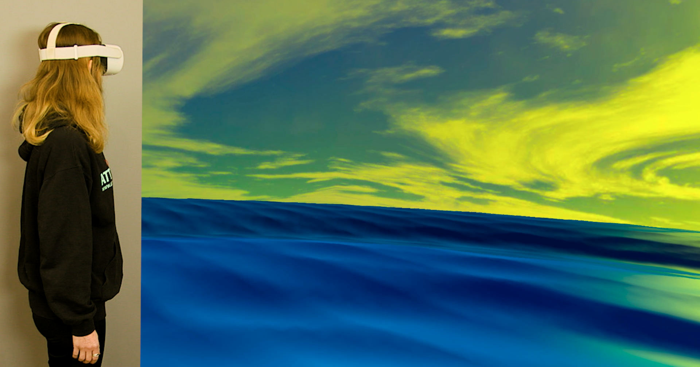

# AttysHRV



An immersive heartrate variability (HRV) biofeedback app for the Oculus Quest 2 and the [Attys](https://www.attys.tech) to de-stress.

The app turns the heartrate into a seaside animation where the idea is
that a relaxed person has a regular physiological heartrate variability
which creates large regular waves in the animation. The person can use
deep breathing to create these and in turn relax.

The high precision bioamplifier [Attys](https://www.attys.tech) is
used to record the ECG in realtime and the Oculus then detects
with high precision the heartbeats and calculates the heartrate.

The app is written in C++ using the openXR / openGL framework
which allows realtime processing and animation of the ECG
in the headset.

## APK

Download the [APK](<./app-release.apk>) and sideload it on the Oculus.

## Compiling from source

### Prerequisites

1. Change into `AttysHRV/app/src/main/cpp` and clone the IIR filter library and the spline interpolation library:

```
git clone https://github.com/berndporr/iir1.git
git clone https://github.com/berndporr/cxx-spline.git
```

2. Download the [Oculus openXR API](https://developer.oculus.com/downloads/package/oculus-openxr-mobile-sdk/), create
   a subdirectory `ovr_openxr_mobile_sdk` and unzip the contents of the openxr SDK into it.

   Edit `app/src/main/cpp/CMakeLists.txt` and point it to the openXR API:
  `set(OCULUS_OPENXR_MOBILE_SDK /home/yourname/ovr_openxr_mobile_sdk)`

3. Clone [AttysComm](https://github.com/glasgowneuro/AttysComm) and modify `app/build.gradle` so that it points
   to AttysComm.

### Compile & run

Start Android Studio, open AttysHRV and click `run`.

## How to use the app

https://glasgowneuro.github.io/AttysHRV/
